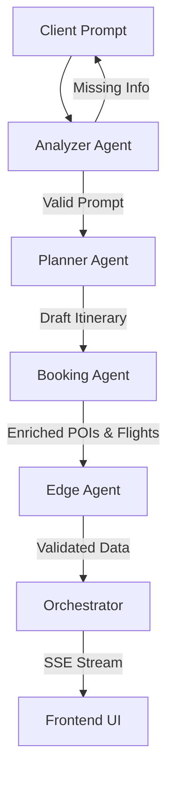

<div align="center">
  

  <h1>DaddiesTrip</h1>

  <p><strong>AI-Powered Cross-Border Travel Orchestration & Group Expense Platform</strong></p>

  <p>
    <a href="https://daddies-trip.vercel.app/"><strong>Live Demo</strong></a>
  </p>

  [](https://vitejs.dev/)
  [](https://reactjs.org/)
  [](https://fastapi.tiangolo.com/)
  [](https://www.python.org/)
  [](https://tailwindcss.com/)
  [](https://railway.app/)
  [](https://vercel.com/)
</div>

<br />

## Table of Contents

- [Overview](#overview)
- [Problem Statement](#problem-statement)
- [Key Features](#key-features)
- [System Architecture](#system-architecture)
- [Tech Stack](#tech-stack)
- [Project Structure](#project-structure)
- [Getting Started](#getting-started)
  - [Prerequisites](#prerequisites)
  - [Installation](#installation)
  - [Environment Variables](#environment-variables)
- [Deployment](#deployment)
  - [Backend on Railway](#backend-on-railway)
  - [Frontend on Vercel](#frontend-on-vercel)
- [API Reference](#api-reference)
  - [Endpoints](#endpoints)
  - [SSE Event Types](#sse-event-types)
- [Agent Pipeline](#agent-pipeline)
- [Testing](#testing)
- [License](#license)

---

## Overview

**DaddiesTrip** is a full-stack AI travel planning platform that automates the entire lifecycle of group travel — from a single natural language prompt to a complete, actionable itinerary with real flight options, hotel recommendations, activity scheduling, and precise multi-currency expense splitting.

Built for the **UM Hackathon 2026**, the platform eliminates the need to juggle multiple apps for itinerary drafting, flight bookings, map routing, and manual spreadsheet calculations for cost splitting.

## Problem Statement

Group travel planning is fragmented. Users typically switch between 4–5 apps to:

1. Draft itineraries manually
2. Search for flights across different airlines
3. Find accommodations and activities
4. Calculate cost splits across multiple currencies

**DaddiesTrip solves this** by providing a single conversational interface that orchestrates the entire process end-to-end using a multi-agent AI pipeline.

## Key Features

- **Conversational Trip Planning** — Describe your trip in plain English (or via voice input). The AI extracts destination, dates, group size, and budget, then generates a structured day-by-day itinerary.
- **Real-Time SSE Streaming** — Server-Sent Events deliver progressive results as each agent completes its task — no waiting for the entire pipeline to finish before seeing output.
- **Flight & Hotel Orchestration** — Real airline options with actual pricing, departure/arrival times, and direct links to Skyscanner and Google Flights for booking.
- **Smart Item Amending** — Customize any generated hotel, restaurant, or activity with natural language preferences (e.g., "cheaper", "halal", "outdoor activities").
- **Interactive Google Maps** — Every activity location is embedded with a live Google Maps iframe for instant geographic context.
- **Multi-Currency Expense Splitting** — Automatic cost division across group members with live exchange rates (via `@fawazahmed0/currency-api`) and deterministic offline fallbacks for 17+ currencies.
- **Simulated Payment Settlement** — Secure card payment flow with visual card preview, input validation, and booking confirmation animation.
- **Voice Input** — Web Speech API integration for hands-free trip description with real-time transcription.
- **PDF Export** — One-click itinerary download as a printable PDF with flights, daily schedule, costs, and hotel details.
- **Responsive Design** — Fully responsive UI built with Tailwind CSS, optimized for mobile, tablet, and desktop.

---

## System Architecture

DaddiesTrip uses a **4-Agent Pipeline** that strictly decouples tasks to minimize LLM hallucinations and optimize processing speed.



| Agent | Type | Responsibility |
|-------|------|----------------|
| **Analyzer** | LLM + Regex | Validates the prompt has all required fields (destination, dates, participants, budget). Returns clarification requests if anything is missing. |
| **Planner** | LLM | Generates a day-by-day itinerary with activities, food recommendations, transport vectors, and weather advice. |
| **Booking** | LLM | Enriches the draft with real-world metadata — hotel names/costs/ratings, flight options with airline data, precise POI costs, and star ratings. |
| **Edge** | Python Heuristics | Deterministic QA layer that detects and corrects AI hallucinations (e.g., identical repeated costs, invalid flight routes, missing required fields). |

The **Orchestrator** coordinates these agents sequentially, streaming intermediate results to the frontend via SSE at each stage so users see progress in real time.

---

## Tech Stack

| Layer | Technology | Purpose |
|-------|-----------|---------|
| **Frontend** | React 18, Vite 5 | SPA with fast HMR and optimized builds |
| **Styling** | Tailwind CSS 3 | Utility-first responsive design |
| **Icons** | Lucide React | Consistent icon set |
| **Backend** | FastAPI | Async Python API with automatic OpenAPI docs |
| **AI/LLM** | Ilmu AI API (OpenAI-compatible) | Multi-agent inference via streaming |
| **Data** | Pandas | Expense aggregation and currency conversion |
| **Validation** | Pydantic | Request/response schema enforcement |
| **Currency** | @fawazahmed0/currency-api | Live FX rates with offline fallback |
| **Maps** | Google Maps Embed API | Activity location visualization |
| **Voice** | Web Speech API | Browser-native speech recognition |
| **Deployment (Backend)** | Railway | Persistent containers with no timeout limits |
| **Deployment (Frontend)** | Vercel | CDN-served static site with edge rewrites |
| **Containerization** | Docker | Multi-stage build for backend deployment |

---

## Project Structure

```
UMHackathon-DaddiesTrip/
├── backend/
│   ├── agents/
│   │   ├── __init__.py
│   │   ├── base_agent.py          # LLM client, JSON repair, retry logic
│   │   ├── analyzer_agent.py      # Prompt validation & field extraction
│   │   ├── planner_agent.py       # Day-by-day itinerary generation
│   │   ├── booking_agent.py       # Flight/hotel/activity enrichment & amending
│   │   ├── edge_agent.py          # Hallucination detection & correction
│   │   └── mock_agents.py         # Orchestrator — pipeline coordinator
│   ├── ledger/
│   │   ├── __init__.py
│   │   └── ledger_service.py      # Currency conversion & payment settlement
│   ├── tests/
│   │   ├── __init__.py
│   │   └── test_agents.py         # PyTest suite (TC-01, TC-02, AI-01)
│   ├── main.py                    # FastAPI app with SSE endpoints
│   └── requirements.txt
├── frontend/
│   ├── App.jsx                    # Main React application (all UI logic)
│   ├── main.jsx                   # React entry point
│   ├── index.html
│   ├── index.css
│   ├── style.css
│   ├── logo.jpeg
│   ├── package.json
│   ├── vite.config.js
│   ├── tailwind.config.js
│   └── postcss.config.js
├── api/
│   └── index.py                   # Vercel Serverless Function entry point
├── .env.example
├── Dockerfile
├── vercel.json
├── requirements.txt
└── README.md
```

---

## Getting Started

### Prerequisites

- **Python 3.10+**
- **Node.js 18+** and npm
- A valid **Ilmu AI API Key** (or any OpenAI-compatible API key)

### Installation

**1. Clone the repository**

```bash
git clone https://github.com/SkyLee310/UMHackathon-DaddiesTrip.git
cd UMHackathon-DaddiesTrip
```

**2. Configure environment variables**

```bash
cp .env.example .env
```

Edit `.env` with your API key and configuration (see [Environment Variables](#environment-variables)).

**3. Start the backend**

```bash
pip install -r requirements.txt
uvicorn backend.main:app --reload
```

The API runs at `http://localhost:8000`. Verify with: `http://localhost:8000/api/health`

**4. Start the frontend** (in a separate terminal)

```bash
cd frontend
npm install
npm run dev
```

The dev server runs at `http://localhost:5173`. API requests are automatically proxied to the backend.

### Environment Variables

| Variable | Description | Default |
|----------|-------------|---------|
| `Z_AI_API_KEY` | API key for the LLM service | Required |
| `Z_AI_BASE_URL` | LLM API base URL | `https://api.ilmu.ai/v1/chat/completions` |
| `Z_AI_MODEL` | Model identifier | `ilmu-glm-5.1` |
| `VITE_API_BASE_URL` | Backend URL for frontend | Empty (uses Vite proxy in dev) |

---

## Deployment

The app uses a **split deployment** architecture with two hosting platforms:

| Component | Hosting Platform | Module/Service | Why |
|-----------|-----------------|----------------|-----|
| **Backend** | [Railway](https://railway.app) | Docker container (`Dockerfile`) | Persistent containers with no hard timeout — required for LLM agent pipelines that take 30–90+ seconds |
| **Frontend** | [Vercel](https://vercel.com) | Vite static build (`vercel.json`) | CDN-served SPA with automatic HTTPS and edge rewrites |

> **Why Railway for the backend?** Vercel Serverless Functions timeout at 10s (Hobby) / 60s (Pro). The DaddiesTrip agent pipeline can take 30–90+ seconds per request. Railway runs **persistent Docker containers** with no hard timeout, making it the right fit.

### Backend on Railway

1. **Create a Railway project** at [railway.app](https://railway.app)
   - Click **"New Project"** → **"Deploy from GitHub repo"**
   - Select your repository

2. **Configure the service** — Railway auto-detects the `Dockerfile` in the project root. No additional build configuration needed.

3. **Set environment variables** in the Railway dashboard under **Variables**:
   ```
   Z_AI_API_KEY=your_api_key_here
   Z_AI_BASE_URL=https://api.ilmu.ai/v1/chat/completions
   Z_AI_MODEL=ilmu-glm-5.1
   ```
   Railway automatically provides the `PORT` variable.

4. **Deploy** — Railway builds and deploys automatically. Note your app URL and verify via `/api/health`.

### Frontend on Vercel

1. **Set the API base URL** in Vercel environment variables:
   ```
   VITE_API_BASE_URL=https://your-app.up.railway.app
   ```

2. **Deploy to Vercel**
   - Connect your GitHub repository
   - **Framework Preset:** Vite
   - **Root Directory:** `./`
   - Add the `VITE_API_BASE_URL` environment variable
   - Deploy

---

## API Reference

### Endpoints

| Method | Endpoint | Description |
|--------|----------|-------------|
| `POST` | `/api/plan-trip-stream` | Primary pipeline trigger. Streams results via SSE. |
| `POST` | `/api/amend-item` | Amend a specific hotel, food, or activity item. |
| `POST` | `/api/settle` | Simulate group ledger card payment settlement. |
| `GET` | `/api/health` | Service health check. |

### SSE Event Types

Emitted by `/api/plan-trip-stream` during the agent pipeline:

| Event Type | Payload | When |
|------------|---------|------|
| `progress` | `{ text }` | A new pipeline stage begins |
| `clarification` | `{ message, missing_fields }` | Analyzer detects missing prompt fields |
| `partial_itinerary` | `{ days, num_participants }` | Planner completes the draft itinerary |
| `partial_flights` | `{ flight_options, num_participants }` | Booking agent resolves transport |
| `complete` | `{ data: FullTripObject }` | Edge Agent validates the final payload |
| `error` | `{ message }` | Fatal pipeline failure |

**Request body for `/api/plan-trip-stream`:**

```json
{
  "prompt": "5 days in Tokyo for 4 people under RM5000"
}
```

**Request body for `/api/amend-item`:**

```json
{
  "item_type": "hotel",
  "current_item": { "name": "Hotel A", "cost_myr": 300 },
  "user_preference": "cheaper, near train station",
  "trip_summary": { "destination": "Tokyo", "budget_myr": 5000 }
}
```

**Request body for `/api/settle`:**

```json
{
  "group_id": "group_123",
  "user_id": "user_1",
  "card_number": "4111111111111111"
}
```

---

## Agent Pipeline

The orchestrator (`OrchestratorAgent`) processes each request through the following steps:

1. **Input Truncation** — Prompts exceeding 1,500 words are truncated to prevent buffer overflow.
2. **Analyzer** — Validates the prompt has all 4 required fields. If not, returns a `clarification` event and halts.
3. **Planner** — Generates a day-by-day itinerary skeleton. A `partial_itinerary` event is streamed immediately so the user sees progress.
4. **Booking** — Enriches the draft with real-world data (flights, hotels, activity costs, food recommendations). A `partial_flights` event is streamed upon completion.
5. **Budget Calculation** — Pure Python computation (no LLM) that aggregates all costs, compares against the user's budget, and generates saving tips.
6. **Currency Conversion** — Fetches live exchange rates for the destination currency with offline fallback.
7. **Edge Validation** — Heuristic checks that detect and correct common LLM hallucinations:
   - RM25 cost repetition bug
   - Same departure/return airport on round-trip flights
   - Missing day numbers or locations
8. **Final Emission** — The validated `complete` event is sent with the full trip object.

---

## Testing

The PyTest suite covers end-to-end pipeline validation, negative payment cases, and input safety.

```bash
python -m pytest backend/tests/test_agents.py -v
```

| Test ID | Description |
|---------|-------------|
| `TC-01` | End-to-end SSE pipeline — validates complete schema (itinerary, flights, budget, split) from a valid prompt |
| `TC-02` | Deterministic ledger rejection — verifies invalid card numbers are rejected |
| `AI-01` | Buffer overflow protection — ensures oversized prompts are truncated to 1,500 words before reaching the LLM |

---

## License

This project was built for the **UM Hackathon 2026** by students of Universiti Teknologi Malaysia.

<div align="center">
  <i>Engineered by ❤️ from UTM's students</i>
</div>
