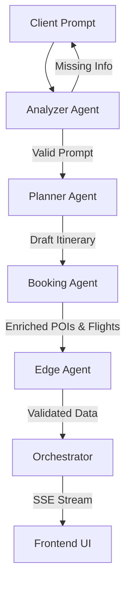

<div align="center">
  

  <h1>DaddiesTrip ✈️</h1>
  
  <p><strong>An AI-Enabled Cross-Border Travel Orchestration & Group Accounting Platform</strong></p>

  [](https://vitejs.dev/)
  [](https://reactjs.org/)
  [](https://fastapi.tiangolo.com/)
  [](https://www.python.org/)
  [](https://vercel.com/)
</div>

<br />

## 📖 Table of Contents
- [Project Overview](#-project-overview)
- [Key Features](#-key-features)
- [System Architecture](#-system-architecture)
- [Local Development Setup](#-local-development-setup)
- [Deployment (Vercel)](#-deployment-vercel)
- [API Documentation](#-api-documentation)
- [Testing & QA](#-testing--qa)

---

## 📌 Project Overview

**DaddiesTrip** addresses the highly fragmented process of group travel planning and multi-currency expense management. Typically, users switch between multiple apps for itinerary drafting, flight bookings, map routing, and manual spreadsheet calculations for cost splitting.

**Our Mission:** Automate the entire lifecycle of group travel through a unified, conversational interface. From initial natural language prompts to structured itineraries, real-world flight options, and precise multi-currency expense splitting, DaddiesTrip provides a frictionless and secure digital planning experience.

---

## ✨ Key Features

- **Conversational Planning & Validation:** Transforms unstructured text into strict JSON itineraries using advanced LLM inference. If critical parameters (destination, dates, participants, budget) are missing, the pipeline halts safely and requests user clarification.
- **Real-Time Token Streaming (SSE):** Utilizes Server-Sent Events to stream data progressively. This prevents API gateway timeouts and delivers an ultra-responsive UI experience.
- **Flight & Hotel Orchestration:** Intelligently routes flight options using real-world airline data. Bypasses flight generation for localized travel dynamically.
- **POI Enrichment:** Aggregates real-world cost metrics, Google Reviews, and star ratings for activities, dining, and accommodations.
- **Smart Multi-Currency Ledger:** Calculates exact cost divisions across groups using live exchange rates via the open `@fawazahmed0/currency-api`, with deterministic offline fallbacks.
- **Interactive Geolocation:** Dynamically embeds Google Maps iframes for every generated activity point.
- **Responsive UI/UX:** Built with Tailwind CSS, the application is fully responsive, ensuring flawless operation across mobile, tablet, and desktop viewports.

---

## 🧠 System Architecture

DaddiesTrip utilizes a highly modular **4-Agent Pipeline**, strictly decoupling tasks to eliminate LLM hallucinations and optimize processing speed.



1. **Analyzer Agent *(Python Heuristics)*:** Validates the prompt using regex and keyword extraction. Ensures strict adherence to required fields before incurring any LLM costs.
2. **Planner Agent *(LLM Stream)*:** Drafts the chronological day-by-day itinerary, including transport vectors and activity logic.
3. **Booking Agent *(LLM Stream)*:** Injects real-world metadata (hotels, flights, precise POI costs, and star ratings) into the planner's draft.
4. **Edge Agent *(Python Heuristics)*:** A deterministic QA layer that nullifies AI hallucinations (e.g., repeating identical costs, invalid flight routes) before final payload emission.

---

## 🛠 Local Development Setup

### Prerequisites
- **Python 3.10+**
- **Node.js 18+** & npm
- Valid **Ilmu AI API Key** (or compatible OpenAI-format API key)

### 1. Clone the Repository
```bash
git clone https://github.com/your-username/UMHackathon-DaddiesTrip.git
cd UMHackathon-DaddiesTrip
```

### 2. Environment Configuration
Create a `.env` file in the **root directory**:
```env
Z_AI_API_KEY=your_api_key_here
Z_AI_BASE_URL=https://api.ilmu.ai/v1/chat/completions
Z_AI_MODEL=glm-4
```
*(Note: The server auto-normalizes the base URL if the full completions endpoint is provided).*

### 3. Backend Setup (FastAPI)
Install dependencies and run the server (Terminal 1):
```bash
python -m pip install -r requirements.txt
python -m uvicorn backend.main:app --reload
```
The API will run at `http://localhost:8000`. Verify via the health check: `http://localhost:8000/api/health`.

### 4. Frontend Setup (React/Vite)
Install node modules and start the dev server (Terminal 2):
```bash
cd frontend
npm install
npm run dev
```
The Vite dev server will start at `http://localhost:5173`. API requests are automatically proxied to the backend.

---

## ☁️ Deployment (Vercel)

DaddiesTrip is configured for seamless deployment on Vercel utilizing Serverless Functions for the Python backend.

1. Connect your GitHub repository to Vercel.
2. Set the **Framework Preset** to `Vite`.
3. Set the **Root Directory** to `./` (the repository root).
4. Add your `.env` variables (`Z_AI_API_KEY`, etc.) in the Vercel Dashboard.
5. Deploy.

### ⚠️ Important Vercel Configuration Note (`vercel.json`)
Due to the intensive nature of LLM generation, the application uses a custom `vercel.json` to extend the serverless execution timeout:
```json
{
  "functions": {
    "api/**/*": {
      "maxDuration": 60
    }
  }
}
```
*Note: Vercel's Hobby (Free) tier has a hard limit of `60s`. If you are on a Pro plan, you may increase this to `120` or `300` to support significantly larger prompts.*

---

## 📡 API Documentation

| Method | Endpoint | Description |
|--------|----------|-------------|
| `POST` | `/api/plan-trip-stream` | Primary pipeline trigger. Streams data via Server-Sent Events (SSE). |
| `POST` | `/api/settle` | Simulates secure group ledger card payment settlement. |
| `GET`  | `/api/health` | Service health check. |

### SSE Stream Payload States (`/api/plan-trip-stream`)
| Event Type | Payload Data | Trigger Condition |
|------------|--------------|-------------------|
| `progress` | `{ text }` | Emitted when a new pipeline stage begins. |
| `clarification` | `{ message, missing_fields }` | Emitted if the Analyzer Agent detects missing prompt context. |
| `partial_itinerary`| `{ days, num_participants }` | Emitted when the Planner Agent completes drafting. |
| `partial_flights` | `{ flight_options, num_participants }` | Emitted when the Booking Agent resolves transport. |
| `complete` | `{ data: FullTripObject }` | Final payload emission upon Edge Agent validation. |
| `error` | `{ message }` | Fatal pipeline failure. |

---

## ⚙️ Testing & QA

DaddiesTrip includes a comprehensive PyTest suite covering agent validation, streaming schema integrity, and ledger operations.

Execute tests from the root directory:
```bash
python -m pytest backend/tests/test_agents.py
```

**Key Test Coverage:**
- `TC-01`: Validates end-to-end SSE pipeline schema generation (Itinerary, Flights, Budget, Split).
- `TC-02`: Validates deterministic ledger rejections for invalid payment methods.
- `AI-01`: Ensures buffer overflow protection against massive user prompts.

---
<div align="center">
  <i>Engineered with ❤️ by UTM's students</i>
</div>
